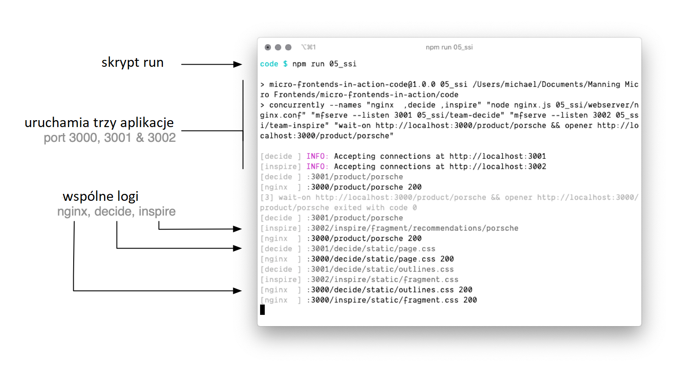
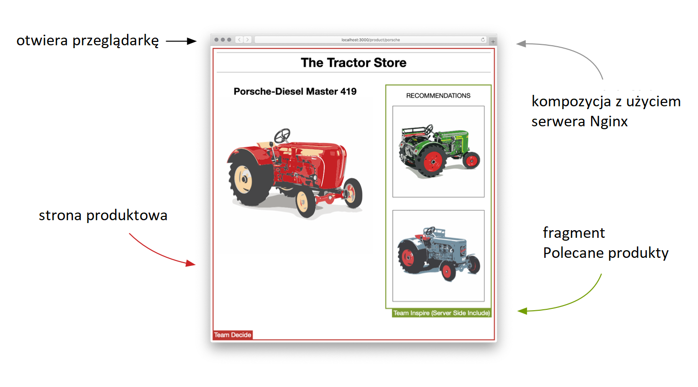

# Przykładowe kody - Mikrofrontendy w akcji

Oto przykłady aplikacji do książki [Mikrofrontendy w akcji](https://helion.pl/ksiazki/mikrofrontendy-w-akcji-michael-geers,mikrak.htm#format/d).

## Przykłady na stronie

Działające przykłady możesz zobaczyć na tej stronie (w języku angielskim):<br> [https://the-tractor.store](https://the-tractor.store) 🚜

## Lokalne uruchamianie aplikacji

### Wymagania wstępne

1. Upewnij się, że masz zainstalowane środowisko [Node.js](https://nodejs.org/) (w wersji 12 lub nowszej).

   ```
   $ node -v
   v14.4.0
   ```

2. Przejdź do katalogu z rozpakowanym repozytorium i zainstaluj wszystkie wymagane zależności.

   ```
   cd [katalog_repozytorium]
   npm install
   ```

4. Zainstaluj serwer Nginx na swoim urządzeniu. Wystarczy obecność pliku wykonywalnego `nginx`. Nie jest potrzebna żadna konfiguracja.

   - _macOS (za pomocą narzędzia [Homebrew](https://brew.sh)):_ `brew install nginx`
   - _Debian/Ubuntu:_ `sudo apt-get install nginx`
   - _Windows:_ Pliki binarne są załączone do tego repozytorium. Nie jest konieczna instalacja.

   Serwer Nginx jest potrzebny do uruchomienia następujących pięciu przykładów:

   - `04_routing`
   - `05_ssi`
   - `06_timeouts_down`
   - `16_universal`
   - `18_asset_registration_include`

### Uruchomienie kodu

Wszystkie przykłady wymagają uruchomienia więcej niż jednej aplikacji, z których każda należy do innego zespołu. Dla każdego katalogu przygotowano skrypt npm run. Przykłady można uruchamiać w następujący sposób: `npm run [nazwa przykładu]`.

Następujące polecenie uruchomi przykład 5:

```
npm run 05_ssi
```

Skrypt **uruchomi wszystkie aplikacje** i **będzie wyświetlać wszystkie logi**.<br>
_UWAGA: Wydruki na konsoli Nginx nie działają na systemie operacyjnym Windows_.



Skrypt **czeka, aż serwery są gotowe,** i **otwiera stronę z przykładem** w domyślnej przeglądarce.



Możesz zatrzymać przykład używając kombinacji klawiszy `[CMD]` + `C` w konsoli.

## Struktura katalogów i porty

Każdy przykład znajduje się w oddzielnym katalogu (np. `05_ssi`). Każdy katalog z przykładem zawiera podkatalogi, które zawierają poszczególne aplikacje (np. `nginx`, `decide`, `inspire`).

Różne numery portów wskazują odpowiedzialność różnych zespołów. Poniższa tabela pokazuje powiązania między portami a zespołami. Upewnij się, że na Twoim urządzeniu porty od 3000 do 3003 nie są przypisane do innych procesów.

| Port   | Zespół             | Odpowiedzialność                                      |
| ------ | ------------------ | ----------------------------------------------------- |
| `3000` | - wspólna -        | infrastruktura (serwer WWW, powłoka aplikacji)        |
| `3001` | Zespół Decyzji     | strony produktowe                                     |
| `3002` | Zespół Inspiracji  | strona główna, wyszukiwanie, polecane produkty        |
| `3003` | Zespół Zakupów     | koszyk, finalizacja zakupów                           |

## Lista wszystkich przykładów

Oto lista wszystkich poleceń run wraz z rozdziałem, do którego się odnoszą.

| Skrypt run                                          | Nazwa przykładu                                                                       | Rozdział  |
| --------------------------------------------------- | ------------------------------------------------------------------------------------- | --------- |
| `npm run 01_pages_links`                            | Strony powiązane łączami                                                                   | [2]  |
| `npm run 02_iframe`                                 | Ramki iframe                                                                               | [2]  |
| `npm run 03_ajax`                                   | Przestrzenie nazw                                                                          | [3]  |
| `npm run 04_routing`                                | Routing po stronie serwera                                                                 | [3]  |
| `npm run 05_ssi`                                    | Integracja po stronie serwera                                                              | [4]  |
| `npm run 06_timeouts_down`<br>`npm run 06_timeouts_short_delay`<br>`npm run 06_timeouts_long_delay` | Limity czasu i treści zastępcze            | [4]  |
| `npm run 07_podium`                                 | Podium                                                                                     | [4]  |
| `npm run 08_web_components`                         | Kompozycja po stronie klienta                                                              | [5]  |
| `npm run 09_shadow_dom`                             | Izolacja stylów i mechanizm Shadow DOM                                                     | [5]  |
| `npm run 10_parent_child_communication`             | Komunikacja od komponentu nadrzędnego do podrzędnego                                       | [6]  |
| `npm run 11_child_parent_communication`             | Komunikacja od komponentu podrzędnego do nadrzędnego                                       | [6]  |
| `npm run 12_fragment_fragment_communication`        | Komunikacja między fragmentami                                                             | [6]  |
| `npm run 13_client_side_flat_routing`               | Routing po stronie klienta (wersja płaska)                                                 | [7]  |
| `npm run 14_client_side_two_level_routing`          | Routing po stronie klienta (dwupoziomowy)                                                  | [7]  |
| `npm run 15_single_spa`                             | Framework single-spa                                                                       | [7]  |
| `npm run 16_universal`                              | Uniwersalne renderowanie                                                                   | [8]  |
| `npm run 17_asset_client_redirect`                  | Przekierowania do zasobów po stronie klienta                                               | [10] |
| `npm run 18_asset_registration_include`             | Rejestracja zasobów za pomocą dyrektywy include                                            | [10] |
| `npm run 19_shared_vendor_webpack_dll`              | Współdzielenie bibliotek zewnętrznych za pomocą wtyczki Webpack DLLPlugin                  | [11] |
| `npm run 20_shared_vendor_rollup_absolute_imports`  | Współdzielenie bibliotek zewnętrznych dzięki narzędziu Rollup.js oraz importowi modułów ES | [11] |
| `npm run 21_local_development`                      | Rozwój w środowisku lokalnym                                                               | [14] |
